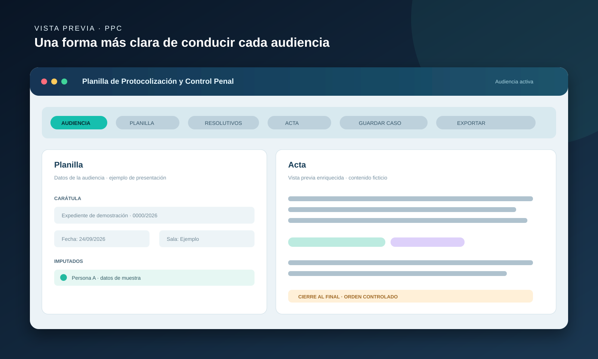
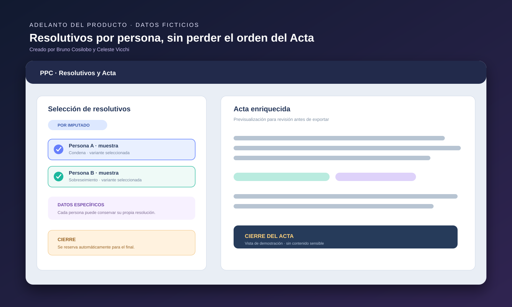

# PPC — Planilla de Protocolización y Control Penal

**Creado por Bruno Cosilobo y Celeste Vicchi.**

Aplicación web estática para armar, revisar y exportar actas judiciales mediante cuerpos, resolutivos modulares y soporte para múltiples imputados.

> **Proyecto propietario de Bruno Cosilobo y Celeste Vicchi — uso e implementación únicamente con autorización escrita de ambos titulares.**

## Características

- Cuerpos principales y resolutivos combinables.
- Selección de una resolución común o asignación por imputado.
- Variantes y campos específicos para cada imputado.
- Vista previa del Acta con cierre obligatorio al final.
- Copia enriquecida, exportación a Word e impresión/PDF limpio.
- Casos guardados en el navegador mediante `localStorage`.
- Consola de audiencia con cronómetro y control de pendientes.
- Accesibilidad: contraste alto, tamaño de texto y foco visible.

## Vista del proyecto

Estas imágenes son adelantos visuales del producto. Tienen datos ficticios y no muestran la lógica interna ni expedientes reales:

## Uso local

El repositorio es público para documentación y evaluación. **No existe permiso general para ejecutar, instalar, implementar, copiar, modificar, redistribuir o integrar este proyecto.** Cualquier uso requiere autorización previa, expresa y escrita de Bruno Cosilobo y Celeste Vicchi.

## Autoría

El diseño visual, la arquitectura de interfaz, la implementación del software, el código y las funcionalidades originales de este repositorio son autoría conjunta de **Bruno Cosilobo y Celeste Vicchi**.

La publicación en GitHub no transfiere derechos ni constituye una licencia de uso. No se permite crear forks, réplicas, adaptaciones o implementaciones sin autorización escrita de ambos titulares.

## Solicitud de autorización

Toda solicitud debe describir el uso previsto, la organización o persona solicitante, el alcance de la implementación, el plazo, el entorno y cualquier distribución prevista. La autorización solo será válida si consta por escrito y es emitida por Bruno Cosilobo y Celeste Vicchi.

## Alcance jurídico

La autoría del software y del diseño no implica autoría sobre normas, fórmulas, modelos, textos jurídicos, citas legales o contenidos institucionales de terceros que puedan estar incorporados como referencia. La herramienta es de asistencia documental y no reemplaza la revisión profesional, judicial o institucional del Acta.

## Licencia

Este proyecto se encuentra bajo la [Licencia Propietaria PPC](./LICENSE). Todos los derechos no concedidos expresamente quedan reservados.
